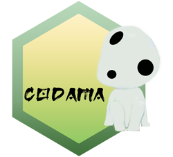

<!-- README.md is generated from README.Rmd. Please edit that file and click on Knit button at the end. -->

```{r, include = FALSE}
knitr::opts_chunk$set(
  collapse = TRUE,
  comment = "#>",
  fig.path = "man/figures/README-",
  out.width = "100%"
)
options(tibble.print_min = 5, tibble.print_max = 5)
```

# codama R package <a href='https://ob7-ird.github.io/codama/'></a>

<!-- badges: start -->
[](https://cran.r-project.org/package=codama)
[](https://www.tidyverse.org/lifecycle/#experimental)
[](https://github.com/OB7-IRD/codama/actions)
<!-- badges: end -->

***Common prOcesses for Data quAlity Monitoring***

## Warning
Package and documentation still in construction !

## Overview

This package aims is to provide a series of standardised and generic controls processes for data quality assessment and monitoring.

* Process transparency: the code is fully documented and the [documentation](https://ob7-ird.github.io/codama/) of how works the program will be available.
* Open access and Open source: the code source is hosted on a github repository [codama](https://github.com/OB7-IRD/codama/) under a GPL version 3 license. In the end, it would be available on the Comprehensive R Archive Network (CRAN).
* Referencing of the software : enable result reproducibility and versioning 

## Installation

Working in progress for this section. Be patient.
```{r, eval = FALSE}
devtools::install_github("https://github.com/OB7-IRD/codama",
                         INSTALL_opts=c("--no-multiarch"))
```

### Development version

To get a bug fix or to use a feature from the development version, you can install the development version of furdeb from GitHub.

```{r, eval = FALSE}
devtools::install_github("https://github.com/OB7-IRD/codama",
                         ref = "development",
                         INSTALL_opts=c("--no-multiarch"))
```

## Cheatsheet

Working in progress for this section. Be patient.

## Usage

```{r, message = FALSE}
library(codama)
# Next steps example will be added later
```

## Getting help

If you encounter a clear bug, please file an issue with a minimal reproducible example on [GitHub issues page](https://github.com/OB7-IRD/codama/issues). This link is also available if you have any questions and improvement propositions.

## References

Working in progress for this section.
